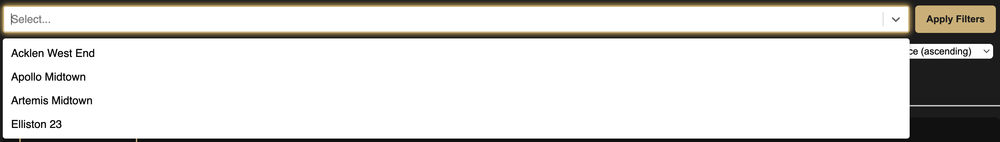

<!-- Chapter copy verbatim from handoff prototype #7a. Chapters (## headings)
     become the "ON THIS SHEET" nav; the pull-quote renders from
     studyMeta.pullQuote (do not duplicate it here). -->

## The problem

Vanderbilt students hunting for off-campus housing were juggling four separate apartment-complex websites with no way to compare price, size, or availability side by side. The listings changed daily; the tabs multiplied.

## The build

Custom scrapers collect listings from all four complexes nightly on a cron schedule, normalize them into MongoDB, and serve a REST API the React frontend filters instantly — price, beds, baths, square footage. Everything runs as six Docker containers on a Chameleon Cloud VM.

*PLATE II — FILTERING & COMPARISON*

## The outcome

Designed the system architecture with two teammates and shipped it end to end — scrapers to UI — for Principles of Cloud Computing. The deployment survived the semester without a restart; the pattern (scrape → normalize → serve) became my default for data-aggregation side projects.
